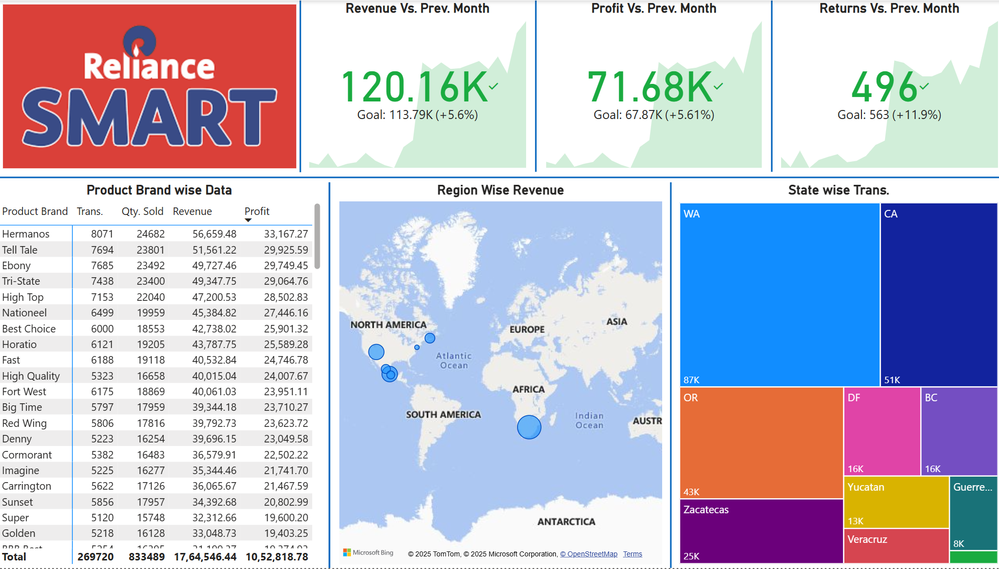
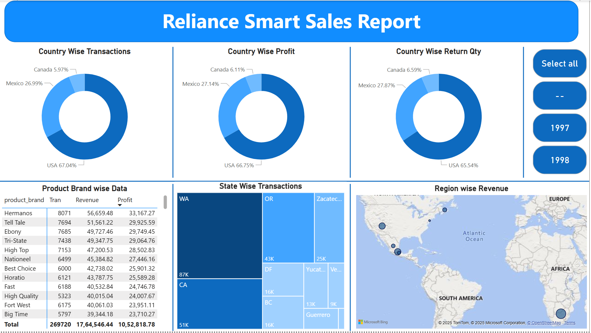

# 📊 Reliance SMART Sales Dashboard – Power BI Report

A visually rich and insightful dashboard built using **Power BI** to monitor and analyze sales performance, returns, and profitability across product brands, regions, and states.

---

## 🖼️ Dashboard Preview

### 🔹 Dashboard View 1: KPI Summary & Brand Performance

*This view highlights key performance indicators (KPIs) such as revenue, profit, and returns compared to previous months, alongside product brand-wise sales data.*

---

### 🔹 Dashboard View 2: Regional & State-Level Analysis

*This section features a region-wise revenue heatmap and a state-wise transaction treemap, helping identify high-performing areas geographically.*

---

## 📌 Summary

This dashboard provides a consolidated view of Reliance SMART’s business performance through:

- Revenue and Profit trends vs. previous month
- Returns analysis
- Product-wise sales performance
- Geographical distribution (Region and State)
- Interactive visuals for decision-making

---

## 🔑 Key Metrics (Current Month vs. Previous Month)

| Metric                | Value     | Goal         | Performance      |
|----------------------|-----------|--------------|------------------|
| Revenue              | ₹120.16K  | ₹113.79K     | +5.6% ✅          |
| Profit               | ₹71.68K   | ₹67.87K      | +5.61% ✅         |
| Returns              | 496       | 563          | -11.9% ✅         |

---

## 📦 Product Brand-Wise Analysis

A scrollable table listing metrics per brand:

- **Columns:** Product Brand, Transactions, Quantity Sold, Revenue, Profit
- **Top 3 Brands by Revenue:**
  - **Hermanos** – ₹56,659.48 (Profit: ₹33,167.27)
  - **Tell Tale** – ₹51,561.22 (Profit: ₹29,925.59)
  - **Ebony** – ₹49,727.46 (Profit: ₹29,749.45)

---

## 🌍 Region-Wise Revenue (Map View)

A geographic heatmap showing revenue contribution from different regions:

- **Highlighted Continents:** North America, Africa, South America, Europe
- Bubble size indicates revenue volume per region.

---

## 🗺️ State-Wise Transactions (Treemap)

A color-coded treemap visual showing transaction count by state:

- **Top States:**
  - **WA:** 87K transactions
  - **CA:** 51K
  - **OR:** 43K
  - **Zacatecas:** 25K

Smaller states include DF, Yucatan, Veracruz, and Guerrero.

---

## 📊 Cumulative Totals

| Metric           | Total         |
|------------------|---------------|
| Transactions     | 2,69,720      |
| Quantity Sold    | 8,33,489      |
| Revenue          | ₹1,76,45,646  |
| Profit           | ₹1,05,28,818  |

---

## 💼 Use Cases

- Business strategy & monthly reviews  
- Sales optimization across regions and brands  
- Inventory and supply chain alignment  
- Identifying and reducing product return rates  
- Performance-based incentive calculation  

---

## 🧰 Tools & Technologies Used

- **Power BI Desktop**
- **Bing Maps for Geovisuals**
- **DAX for KPI Calculations**
- **Data Source:** CSV/Excel/SQL (assumed)

---

## 📁 Files

- `Reliance_Sales_Dashboard.pbix` *(Main Power BI file)*
- `dashboard1.png` *(KPI and Product data view)*
- `dashboard2.png` *(Region and State visuals)*

---

## 🚀 Future Enhancements

- Add time slicers for Monthly/Quarterly filters
- Predictive revenue and demand forecasts
- Customer satisfaction score (CSAT/NPS) integration
- Drill-through capability on visuals

---

## 👨‍💻 Author

**Sheraj Sharif**  
Data Analysis Intern | Power BI Trainer

📧 Gmail: [sherajsharif786@gmail.com](mailto:sherajsharif786@gmail.com)  
🔗 GitHub: [github.com/sherajsharif](https://github.com/sherajsharif)

---

> ⚠️ This dashboard is a sample visualization. For commercial or organizational use, ensure data privacy and source validation.
